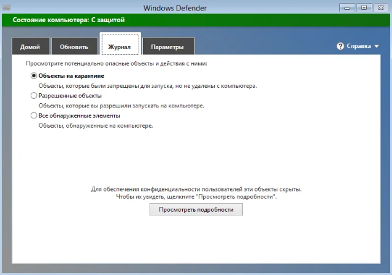
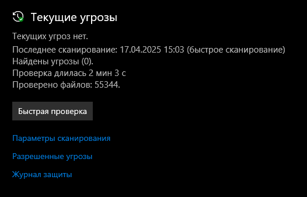
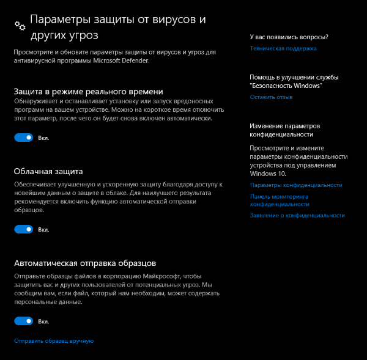

# Учебная практика: Установка антивирусного ПО и настройка безопасности
# Отчёт по настройке безопасности
## 1. Обоснование выбора антивирусного ПО
Исследовали три популярных антивируса: Kaspersky, Avast, Windows Defender.
| Антивирус       | Плюсы                                                                 | Минусы                                                                 | Бесплатная версия | Потребление ресурсов |
|-----------------|----------------------------------------------------------------------|-----------------------------------------------------------------------|-------------------|----------------------|
| Kaspersky       | - Высокая эффективность                                             | - Платный                                                             | Нет               | Высокое              |
|                 | - Регулярные обновления                                             | - Высокое потребление ресурсов                                        |                   |                      |
|                 | - Много функций безопасности                                        |                                                                       |                   |                      |
| Avast           | - Удобный интерфейс                                                  | - Навязывает установку доп. ПО                                       | Да                | Среднее              |
|                 | - Есть бесплатная версия                                            | - Реклама в бесплатной версии                                         |                   |                      |
|                 | - Хорошая защита от фишинга                                          |                                                                       |                   |                      |
| Windows Defender| - Встроен в Windows                                                 | - Меньше функций по сравнению с платными аналогами                   | Да                | Низкое               |
|                 | - Бесплатный                                                         | - Требует настройки для максимальной эффективности                   |                   |                      |
|                 | - Интеграция с системой                                              |                                                                       |                   |                      |
**Выбранный антивирус:** Windows Defender

**Почему выбран именно он:** Windows Defender был выбран из-за того, что он встроен в Windows, бесплатный и не требует дополнительной установки. Также он хорошо интегрируется с системой и имеет низкое потребление ресурсов, что важно для слабых ПК.

## 2. Установка антивируса
**Процесс установки:**
* Где скачали? - Windows Defender уже встроен в Windows, поэтому скачивать его не нужно.

* Что предлагалось установить дополнительно? - Ничего, так как Windows Defender является частью операционной системы.

* Какие опции выбрали? - Включили активную защиту и обновили базы данных.

**Скриншоты:**

## 3. Первичная настройка безопасности
* Об anticipation обновление баз данных (проверено в "Безопасность Windows" → "Защита от вирусов и угроз" → "Проверить обновления").
* Включена активная защита (по умолчанию активна в реальном времени).
* Проведена полная проверка системы (запущена вручную, результаты сохранены).
* Включены следующие функции: [x] Фаерволл (активирован в "Брандмауэр Защитника Windows"). [ ] Защита USB-устройств (не поддерживается в базовой версии). [ ] Родительский контроль (не настраивался, так как не требуется). [x] Веб-защита/блокировка вредоносных сайтов

## 4. Дополнительные меры безопасности
Выполнены следующие дополнительные действия:

1. **Обновление системы Windows:**
* Открыты "Параметры" → "Обновление и безопасность" → "Центр обновления Windows".
* Установлены все доступные обновления, включая исправления безопасности.
2. **Смена пароля на вход:**
* В "Параметрах" → "Учетные записи" → "Варианты входа" установлен новый пароль длиной 12 символов, включающий буквы, цифры и специальные символы.
3. **Отключение автозапуска с флешек:**
* В "Панели управления" → "Автозапуск" снята галочка с "Использовать автозапуск для всех устройств и носителей".
 
## 5. Настройка двухфакторной аутентификации
Была включена двухфакторная аутентификация на Google:

* **Google:**
1. Зайти в аккаунт Google → "Безопасность" → "Двухэтапная аутентификация".
2. Установлено приложение Google Authenticator, отсканирован QR-код, сохранены резервные коды.
## 6. Итоги
* Что нового узнали: Научилась настраивать двухфакторную аутентификацию и отключать автозапуск для повышения безопасности.
* Узнала, как работает встроенный Windows Defender и как оптимизировать его настройки.
* Что было непонятно или вызвало трудности: Настройка некоторых дополнительных функций (например, защита USB-устройств) оказалась недоступной в бесплатной версии Windows Defender.

**Выводы:** Регулярное обновление системы, использование сложных паролей и двухфакторной аутентификации значительно повышают уровень безопасности. Антивирус — важная, но не единственная часть защиты данных.