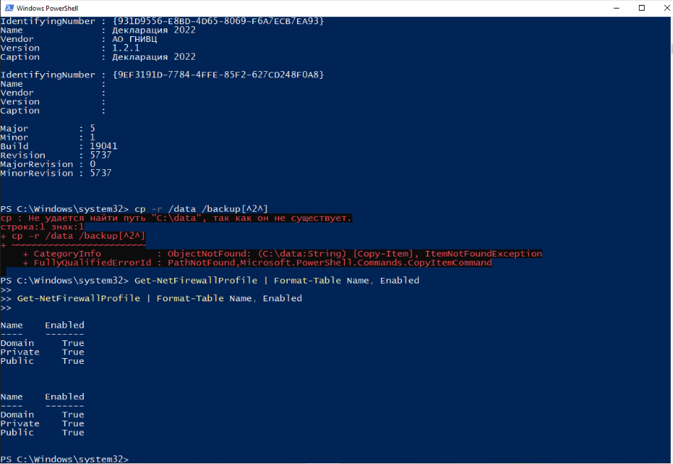
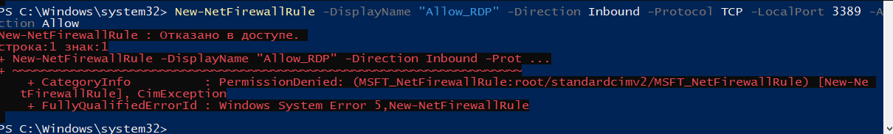

# praktika-4.2
## Учебная практика: Конфигурация брандмауэров и систем защиты данных
# 1. Изучение понятий

**Брандмауэр (Firewall)** — это система безопасности, предназначенная для контроля и управления входящим и исходящим сетевым трафиком на основе заданных правил безопасности. Основная цель брандмауэра — защитить сеть или компьютер от несанкционированного доступа, атак и других угроз.
**Типы:**  
- Сетевой (маршрутизаторы)  
- Персональный (Windows Defender, TinyWall)  
- Аппаратный (Cisco ASA)  
- Облачный (AWS WAF)  

**Системы защиты данных:**  
- Шифрование (BitLocker)  
- Контроль доступа (ACL)  
- Антивирусное ПО  
- DLP-системы  

# 2. Сравнение популярных решений
| Продукт               | Тип          | Уровень контроля | Сложность | Особенности |  
|-----------------------|--------------|------------------|-----------|-------------|  
| Windows Defender      | Персональный | Высокий         | Средний   | Интеграция с ОС |  
| Comodo Firewall       | Персональный | Максимальный    | Высокая   | Песочница, HIPS |  
| TinyWall              | Персональный | Средний         | Низкая    | Минималистичный интерфейс |  

**Выбранный продукт:** Windows Defender Firewall  
**Причина:** Встроен в Windows, поддерживает PowerShell-управление.  

# 3. Установка и базовая настройка
Проверка состояния брандмауэра: 

Get-NetFirewallProfile | Format-Table Name, Enabled
## 4. Конфигурация правил доступа  
### Правило 1: Блокировка Telegram  
**Цель:** Запрет исходящего трафика для мессенджера(в моем случае Браузера).  

New-NetFirewallRule -DisplayName "Block_Edge_Outbound" -Direction Outbound -Program "$env:ProgramFiles (x86)\Microsoft\Edge\Application\msedge.exe" -Action Block

### Правило 2: Разрешение RDP  
**Цель:** Доступ к удалённому рабочему столу.  
**Скриншот настройки:**  

New-NetFirewallRule -DisplayName "Allow_RDP" -Direction Inbound -Protocol TCP -LocalPort 3389 -Action Allow

### Правило 3: Логирование событий  
**Скриншот настройки:**  

Set-NetFirewallProfile -LogFileName "C:\logs\pfirewall.log" -LogMaxSize 2048
## 5. Защита данных  
**Включены функции:**  
- Блокировка неизвестных подключений  
- Интеграция с антивирусом  
- Профили безопасности (Домашний/Публичный)  

## 6. Дополнительные меры  
**Действия:**  
- Обновление ОС через PowerShell:  
Get-WindowsUpdate -Install -AcceptAll
- Отключение ненужных служб;  
- Список доверенных сетей.  
## 7. Настройка двухфакторной аутентификации  
**Пример для Microsoft Account:** 

## 8. Отчёт  
### Полезные функции  
- Централизованное управление через PowerShell  
- Гибкие правила с привязкой к хэшу приложения  

### Сложности  
- Настройка правил для системных процессов (svchost.exe)  
- Интерпретация логов в Event Viewer  

### Безопасный подход  
- Принцип минимальных привилегий  
- Блокировка всех входящих соединений по умолчанию  

### Чему научились  
- Работа с NetSecurity модулем PowerShell  
- Анализ трафика через журналы брандмауэра  

