## Учебная практика: Настройка мониторинга работоспособности ПО (системные утилиты)
# 1. Теоретическая часть
## Что надо знать:

Мониторинг — это наблюдение за работой системы или программы.

**Что можно мониторить:**
* Процессор (CPU)
* Память (RAM)
* Место на диске
* Активные процессы
* Системные логи
### Задача 1: Посмотри, как грузится система

**Графический способ:**
- Откройте **Диспетчер задач** (`Ctrl + Shift + Esc`), вкладка "Производительность" - загрузка CPU, RAM, диска, сети.

**Командная строка:**

wmic cpu get loadpercentage
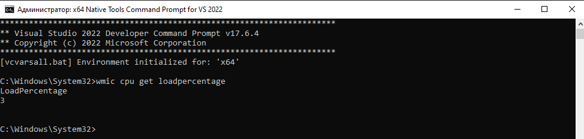
Показывает текущую загрузку процессора (%).

wmic OS get FreePhysicalMemory,TotalVisibleMemorySize
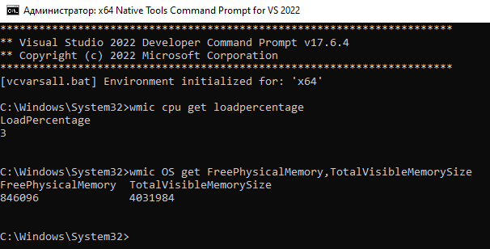
*Показывает свободную и общую оперативную память (КБ).*

**PowerShell:**

Get-Counter "Processor(_Total)% Processor Time" -Continuous
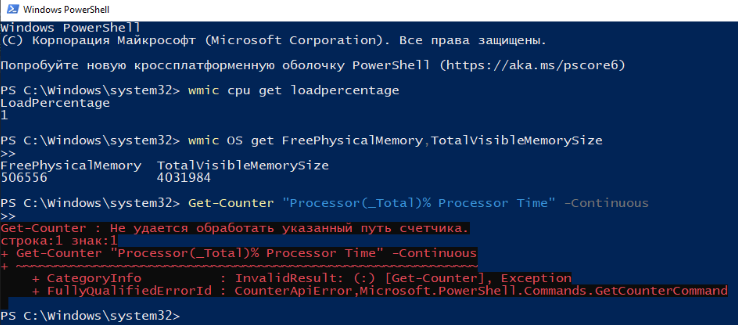
Потоковое отображение загрузки процессора.
## Задача 2: Найди и проверь свой процесс

**Графический способ:**
- Откройте **Диспетчер задач** → вкладка "Процессы". Найдите нужную программу, посмотрите PID, CPU и RAM.

**Командная строка:**
tasklist
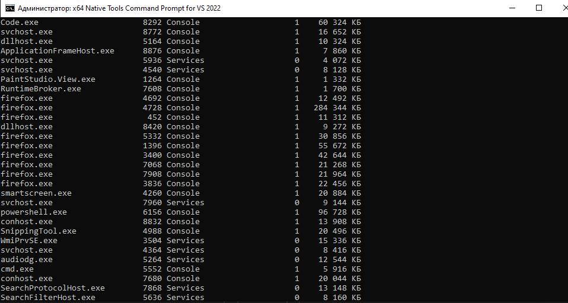
Показывает все процессы.

tasklist | findstr имя_процесса
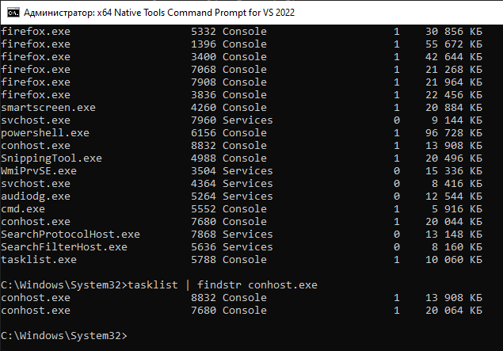
Показывает только нужный процесс (например, `tasklist | findstr notepad`).

wmic process where "name='имя_процесса.exe'" get ProcessId,WorkingSetSize
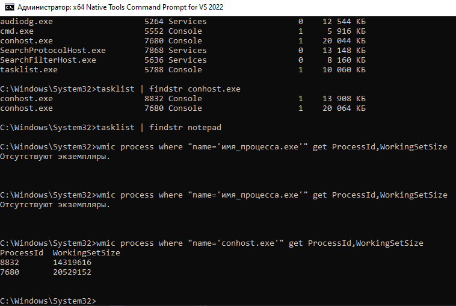
Показывает PID и используемую память процесса.
## Задача 3: Проверка диска
**Графический способ:**
- Откройте "Этот компьютер" → правый клик по диску → "Свойства" - общий и свободный объём.
**Командная строка:**
wmic logicaldisk get size,freespace,caption
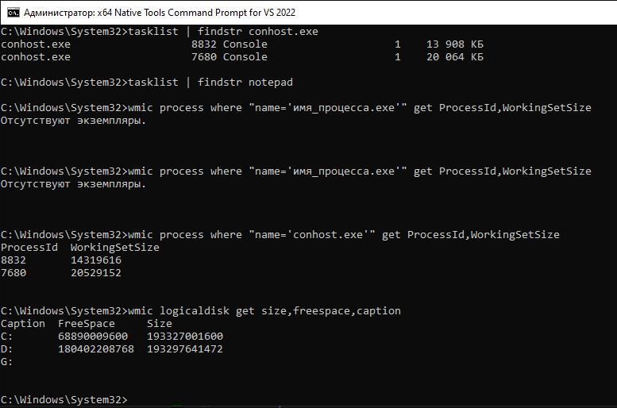
Показывает общий и свободный объём на всех дисках.

dir /s /a
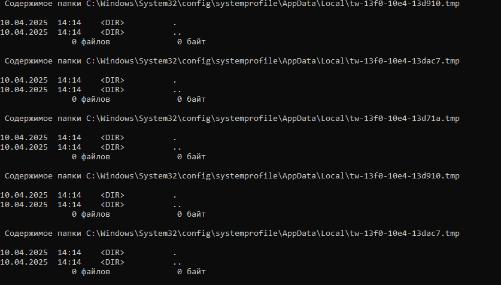
Показывает размер всех файлов и папок в текущей директории.

**Утилита DiskUsage (Windows 10/11):**

diskusage /h c:\
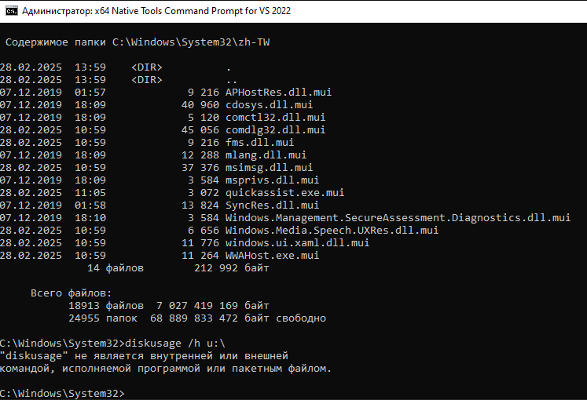
Показывает размер папок на диске C в удобочитаемом виде.
## Задача 4: Лог-файлы
**Графический способ:**
- Откройте "Просмотр событий" (`eventvwr.msc`) → "Журналы Windows" → "Система" или "Приложение".

**Командная строка:**

wevtutil qe System /f:text /c:10
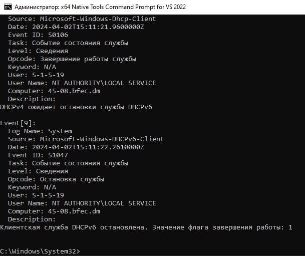
Показывает 10 последних событий системного журнала.

wevtutil qe Application /f:text /c:10
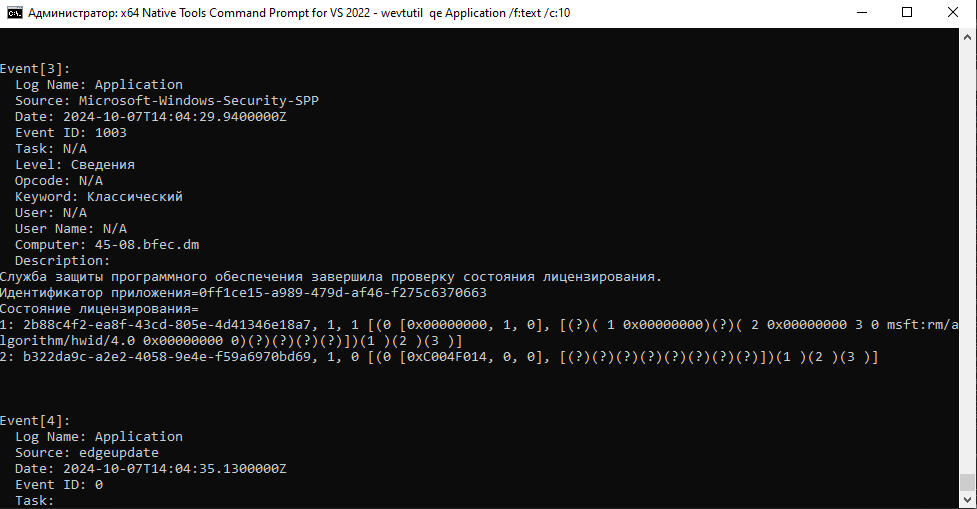
Показывает 10 последних событий журнала приложений.

## Задача 5: Скрипт-монитор
**Пример PowerShell-скрипта:**

Write-Host "Мониторинг:"
Get-Date
(Get-CimInstance Win32_OperatingSystem).LastBootUpTime
Get-WmiObject -Class Win32_OperatingSystem | Select-Object @{Name="TotalMemory (GB)";Expression={"{0:N2}" -f ($.TotalVisibleMemorySize / 1GB)}}, @{Name="FreeMemory (GB)";Expression={"{0:N2}" -f ($.FreePhysicalMemory / 1GB)}}
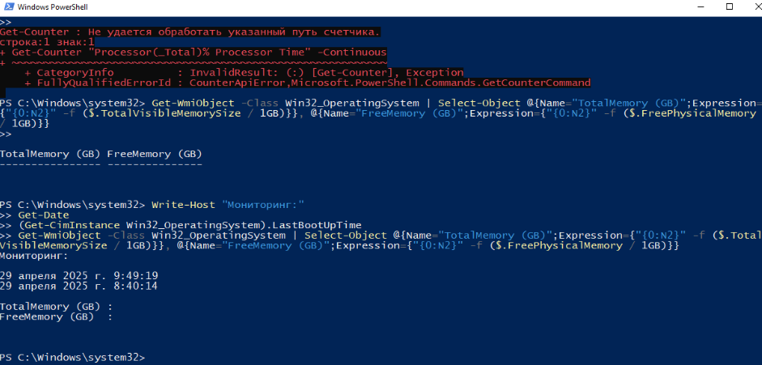
Сохраните как `monitor.ps1`, запустите через PowerShell.
# 3. Выводы
**Какие команды были полезны?**
- `tasklist`, `wmic`, `Get-Counter`, `diskusage`, `wevtutil`, а также Диспетчер задач и Просмотр событий.

**Что нового узнал?**
- Как быстро получить информацию о загрузке системы, процессах и диске в Windows через командную строку и PowerShell.

**Как бы ты автоматизировал мониторинг?**
- Написала бы PowerShell-скрипт с периодическим запуском через Планировщик заданий, результаты сохранял бы в лог-файл и/или настроила бы уведомления при превышении порогов.