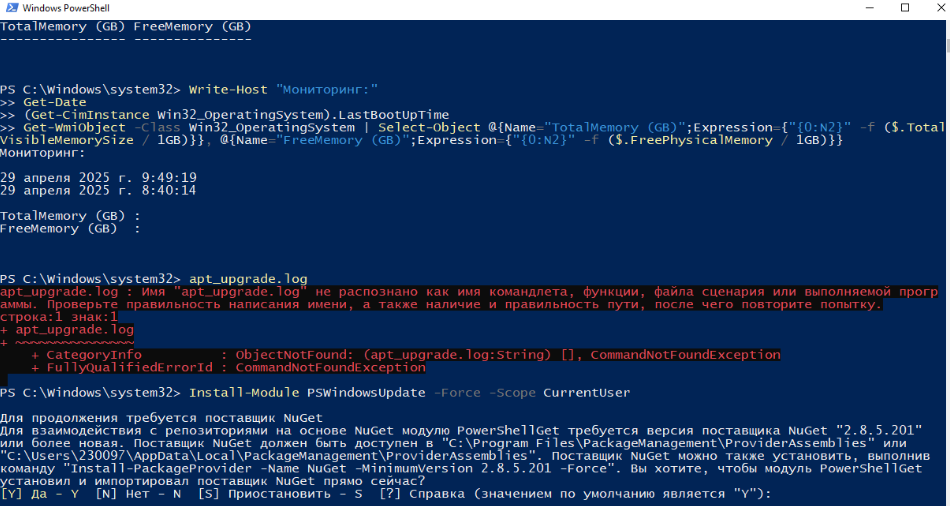
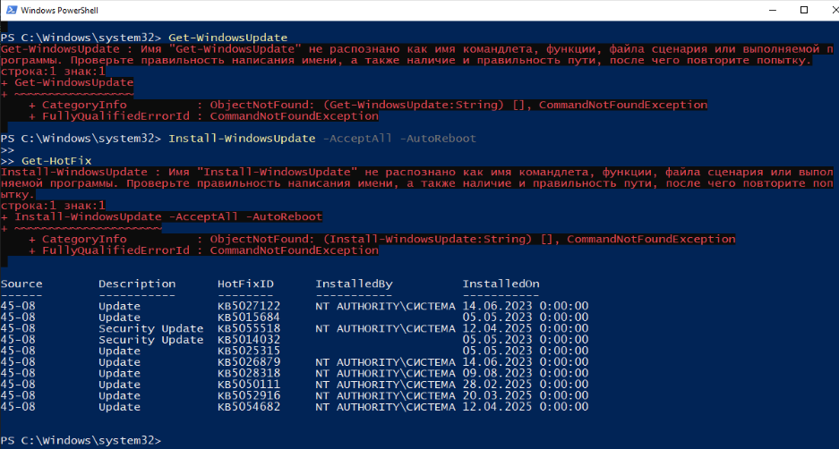

# Учебная практика: Автоматизация обновления и патчинга ПО
## 1. Теоретическая часть

### Зачем обновлять ПО?
- **Закрытие уязвимостей** (например, патчи для CVE-2023-24932 - Black Lotus Secure Boot)
- **Стабильность** (фиксы для BSOD и критичных служб)
- **Новые функции** (обновления .NET Framework и PowerShell)
- **Совместимость** (поддержка новых стандартов безопасности)

### Риски при отсутствии обновлений

Проверка версии PowerShell (должна быть 5.1+ или 7.3+):

$PSVersionTable.PSVersion

*Если версия ниже 5.1 - возможны уязвимости и несовместимость*

### Ручное vs Автоматическое обновление

| Характеристика       | Ручное                  | Автоматическое          |
|----------------------|-------------------------|-------------------------|
| Контроль            | Полный                 | Частичный               |
| Риск забыть         | Высокий                | Низкий                  |
| Тестирование        | Возможно               | Ограничено              |
| Время               | Требует                | Не требует              |
| Для серверов        | Не рекомендуется       | Рекомендуется с тестами |

---

## 2. Практические задачи (Windows)

### Задача 1: Ручное обновление системы

**Команды PowerShell:**

Установка модуля управления обновлениями

Install-Module PSWindowsUpdate -Force -Scope CurrentUser

Проверка доступных обновлений

Get-WindowsUpdate
Установка всех обновлений с перезагрузкой
Install-WindowsUpdate -AcceptAll -AutoReboot

**Что сделать:**
1. Запустите PowerShell от имени администратора
2. Выполните команды последовательно
3. Сохраните вывод: `Get-WindowsUpdate | Out-File C:\update_report.txt`

###  Задача 3: Обновление конкретного ПО

**Пример для .NET Framework:**

Поиск обновлений для конкретного продукта

Get-WindowsUpdate -Title "NET"
Установка выборочных обновлений

Install-WindowsUpdate -KBArticleID "KB503XXXX" -AcceptAll

**Риски:**
- Обновление драйверов может вызвать конфликт оборудования
- Требуется ручная проверка журналов: `Get-EventLog -LogName System -Source "WindowsUpdateClient"`

### Задача 4: Скрипт обновления

**Update-Windows.ps1:**

Write-Host " Запуск обновлений: $(Get-Date)"
Import-Module PSWindowsUpdate
Get-WindowsUpdate -Install -AcceptAll -AutoReboot -IgnoreUserInput
Write-Host " Обновление завершено: $(Get-Date)" | Out-File C:\update.log

**Запуск через CMD:**

powershell -ExecutionPolicy Bypass -File C:\Update-Windows.ps1

###  Задача 5: Проверка уязвимостей

**Команды:**

Проверка последних установленных обновлений

Get-HotFix | Sort-Object InstalledOn -Descending | Select-Object -First 10
Аудит устаревших компонентов

Get-WmiObject -Class Win32_Product | Where-Object {$_.Version -lt "10.0.0"}

text

**Критические компоненты:**
- .NET Framework 4.8+
- PowerShell 5.1/7.3+
- Secure Boot с сертификатом 2023

### Задача 7: Работа со службами

**После обновления Windows Defender:**

Restart-Service -Name WinDefend -Force
Get-Service -Name WinDefend | Select-Object Status, StartType

**Проверка журналов:**

Get-EventLog -LogName Application -Source "Windows Defender" -Newest 5

### ✅ Задача 8: Логирование обновлений

**Log-Update.ps1:**

$LogPath = "C:\Windows\Logs\PSWindowsUpdate.log"
Add-WUServiceManager -ServiceID "7971f918-a847-4430-9279-4a52d1efe18d" -Confirm:$false

Start-Transcript -Path $LogPath -Append
Get-WindowsUpdate -Install -AcceptAll -AutoReboot
Stop-Transcript

**Добавить в Планировщик заданий:**
1. Действие: `Start a program`
2. Программа: `powershell.exe`
3. Аргументы: `-ExecutionPolicy Bypass -File C:\Log-Update.ps1`
###  Задача 9: Напоминалка через PowerShell

**Notify-Updates.ps1:**

$Updates = Get-WindowsUpdate
if ($Updates.Count -gt 0) {
$Body = "Доступно обновлений: $($Updates.Count)`n"
$Body += $Updates | Format-Table -AutoSize | Out-String

text
Send-MailMessage -To "admin@domain.com" -From "updates@domain.com" `
    -Subject "Требуется обновление" -Body $Body -SmtpServer "smtp.domain.com"

}

**Добавить в планировщик:**

schtasks /create /tn "CheckUpdates" /tr "powershell -File C:\Notify-Updates.ps1" /sc daily /st 09:00

## 3. Выводы

### Полезные инструменты
- **PSWindowsUpdate** для управления через PowerShell
- **Windows Admin Center** для удаленного управления
- **WSUS** для корпоративных сред

### Что нового
- Автоматизация через `Invoke-WUJob` для удаленных серверов
- Работа с журналами через `Get-EventLog`
- Интеграция с почтовыми уведомлениями

### Рекомендации

Для критичных серверов использовать тестовый режим:

Install-WindowsUpdate -TestMode -AcceptAll
Создать точку восстановления перед обновлением:

Checkpoint-Computer -Description "Pre-Update" -RestorePointType MODIFY_SETTINGS