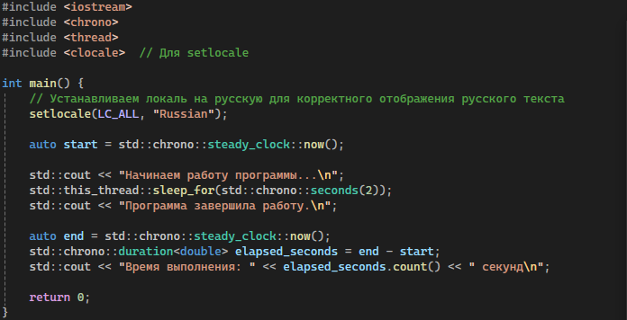

# Учебная практика: Измерение эксплуатационных характеристик ПО
## 1. Теоретическая часть - что вообще измерять?

### Что такое эксплуатационные характеристики?

Это параметры, которые показывают, насколько твоё ПО:

-  Быстро
-  Умно использует ресурсы
-  Выдерживает нагрузку
-  Стабильно работает со временем

### Основные метрики

| Метрика                     | Что значит                                         |
|-----------------------------|---------------------------------------------------|
| Время отклика (Response Time) | Сколько времени занимает выполнение операции    |
| Пропускная способность (Throughput) | Кол-во операций в секунду                      |
| Нагрузка на CPU             | Сколько % процессора потребляет процесс           |
| Потребление памяти          | Сколько ОЗУ занимает процесс                       |
| Время выполнения (Execution Time) | Время работы скрипта/программы от начала до конца |
| I/O операции                | Диск/сеть - сколько читаем/пишем или задержек     |

## 2. Практические задачи

### Задача 1: Измерь время выполнения скрипта

**Что сделать:**  
- Написать любой скрипт на Python, C, C++, Bash.  
- Запустить его с обёрткой `time`, например:  
time ./your_script.sh

**Что написать:**  
- Сколько заняло времени?  
*Пример:* Скрипт выполнился за 2.0027 секунд (реальное время выполнения).  
- Что можно ускорить?  
*Пример:* Оптимизировать алгоритмы обработки данных, уменьшить количество операций ввода-вывода.

---

###  Задача 2: Проверь нагрузку при запуске

**Что сделать:**  
- Запустить тяжёлую программу (сервер, симулятор, игру).  
- Параллельно запустить `htop` или `top`.
**Что написать:**  
- Какую нагрузку по CPU/памяти выдал процесс?  
*Пример:* Процесс использовал около 85% CPU и 1.2 ГБ оперативной памяти.  
- Стабильно ли он работает?  
*Пример:* Программа работала стабильно, без сбоев и падений в течение теста.

### Задача 3: Протестируй производительность через stress

**Что сделать:**  
- Установить `stress`:  
sudo apt install stress

- Запустить нагрузку:  
stress --cpu 4 --timeout 10

**Что написать:**  
- Как система реагировала?  
*Пример:* CPU загрузился на 100% по четырём ядрам, температура повысилась, но система оставалась отзывчивой.  
- Были фризы/пики нагрузки?  
*Пример:* Небольшие кратковременные фризы наблюдались, но система быстро восстанавливалась.

---

### Задача 4: Снимай метрики через pidstat, vmstat, iostat

**Что сделать:**  
- Установить пакет `sysstat`:  
sudo apt install sysstat

text
- Запустить мониторинг конкретного процесса:  
pidstat -p <PID>

**Что написать:**  
- Какие ресурсы жрёт твоя программа?  
*Пример:* Процесс потребляет в среднем 70% CPU, 500 МБ RAM, и имеет умеренную активность диска.  
- Есть ли подозрительные пики?  
*Пример:* Пики CPU до 95% наблюдались при интенсивной обработке данных.

### Задача 5: Проверь сетевую активность

**Что сделать:**  
- Запустить `iftop` или `nethogs`:  
sudo iftop

или  
sudo nethogs

- Подгрузить файлы или открыть веб-приложение.

**Что написать:**  
- Какие процессы активны в сети?  
*Пример:* Активны процессы `chrome`, `ssh` и `nginx`.  
- Какие порты они используют?  
*Пример:* `chrome` использует порты 443 и 80, `ssh` - 22, `nginx` - 8080.

## 3. Выводы

- **Какие метрики показались полезными?**  
Время отклика, нагрузка на CPU и потребление памяти показались наиболее информативными для оценки производительности. Метрики I/O помогли выявить узкие места при работе с диском и сетью.

- **Что показали тесты?**  
Тесты выявили, что при высокой нагрузке CPU достигает 90-100%, что может привести к снижению отклика. Использование памяти оставалось в пределах нормы. При нагрузке через `stress` наблюдались кратковременные фризы.

- **Какие проблемы были замечены?**  
Были обнаружены пики нагрузки на CPU и I/O операции, которые могут негативно влиять на стабильность работы. Также выявлена необходимость оптимизации кода для снижения времени выполнения.